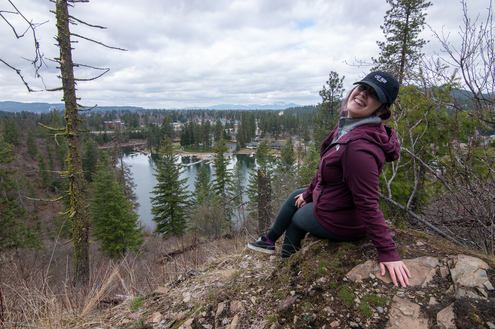
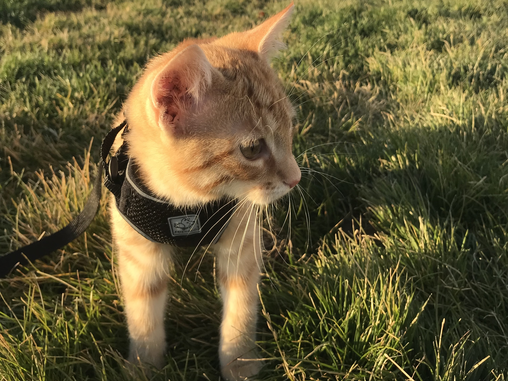

  

  
I am currently working toward my Ph.D. at Washington State University. I study the interaction between clouds and surface radiation over sea ice using both model output from the Polar Weather Research and Forecasting (Polar WRF) model and measurements from the Norwegian Young Sea Ice experiment (N-ICE2015). I also provide virtual technical support for online meetings and conferences through The Conference Exchange (Confex).  

I grew up in central Maine and currently live in eastern Washington with my cat, Flame. I collect houseplants and like taking pictures in my free time.

In 2020 I was awarded a Departmnent of Energy Office of Science Graduate Student Research fellowship, allowing me to perform some of my doctoral research with scientists at the Pacific Northwest National Laboratory.

[WSU doctoral student heading to PNNL thanks to prestigious Department of Energy award](https://news.wsu.edu/2020/05/12/wsu-doctoral-student-heading-pnnl-thanks-prestigious-department-energy-award/)

[Sarah Murphy’s Path Leads to PNNL for ASR-Focused Research](https://asr.science.energy.gov/news/program-news/post/12974)

Additionally, I have been involved in a few field experiments, including:
- **2015** to current - The <a href="https://www.npolar.no/en/projects/n-ice2015/">Norwegian Young Sea Ice (NICE)</a> field expiriment doing data analysis and model testing with data collected during the field experiment. I was not present for the field experiment, but my Ph.D. dissertation is focused on analysis and testing of data collected during this field experiment.
- **2015** & **2017** - The <a href="https://labs.wsu.edu/lar-sensing/icecaps-experiment/">Integrated Characterization of Energy, Atmospheric state, Clouds, and Precipitation at Summit (ICECAPS)</a> field experiment by visiting Summit Station, Greenland once in 2015 and again in 2017 to assist with instrument calibration and testing.
- **2015** - The <a href="https://www.nssl.noaa.gov/projects/pecan/#:~:text=Plains%20Elevated%20Convection%20At%20Night%20(PECAN)%20is%20a%20large%2C,1%20to%20July%2015%2C%202015.">Plains Elevated Convection at Night (PECAN)</a> field experiment, setting up equipment (mesonet trucks, tornado pods, and dopper on wheels radar trucks) during intensive observing periods (IOP) and doing quality assurance between IOP deployments.

  

